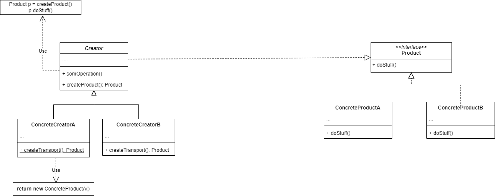

# Factory Method - Creational (Criação)

## Intenção

_Definir uma interface para criar um objeto, mas deixar as subclasses decidirem que classe instanciar. O Factory Method permite adiar a instanciação para as subsclasses._

---

## Sobre o Factory Method

- É um padrão de projeto de criação (lida com a criação de objetos)
- Oculta a lógica de instanciação do código cliente. O método fábrica será responsável por instanciar as classes desejadas
- É obtido através de herança. O método fábrica pode ser criado ou sobrescrito por subclasses
- Dá flexibilidade ao código cliente permitindo a criação de novas factories sem a necessidade de alterar código já escrito (OCP)
- Pode usar parêmetros para determinar o tipo dos objetos a serem criado ou os parâmetros a serem enviados aos objetos sendo criados

---

## Estrutura

## Aplicabilidade

- Use o factory method quando não souber com certeza quais os tipos de objetos o seu código vai precisar
- Use o factory method para permitir a extensão de suas factories para criação de novos objetos (isso ajuda a aplicar o Open/Closed Pricinple)
- Use o factory method para desacoplar o código que cria do código que usa as classes (Single Responsibility Principle)
- Use o factory method para dar um hook (gancho) às subclasses para permitir que elas decidam a lógica de criação de objetos
- Use o factory method para eliminar duplicação de código na criação de objetos

## Implementação - Teoria

Observação importando: todos os objetos criados por um factory method tendem a ser chamaos de "Product" (produto)

1. Crie uma interface em comum para todos os produtos (por exemplo, Product)
2. Crie classes que implementam a interface dos (por exemplo, ConcreteProduct1, ConcreteProduct2...)
3. Crie uma classe (Creator) que implementa ou contem o método fábrice (factory method). Essa classe pode conter dados e outros métodos. São raros os casos onde a classe Creator é simplesmente uma interface com o factory method. O método fábrica é responsável por criar produtos que implemenam a interface "Product".
4. Crie classes concretas que estendem a classe Creator e implementam o método fábrica. As classes ConcreteCreator podem retornar produtos diferentes, contando que esses produtos implementem a interface Product.

## Consequéncias

O que é bom ou ruim no Factory Method:

**Bom:**

- Ajuda a aplicar o Open/Closed Principle. Seu código vai estar aberto para extensão.
- Ajuda na aplicação do Single Responsibility Principle. Serapa o código que cria do código que usa o objeto
- Ajuda no desacoplamento do seu código

**Ruim:**

- Pode causar uma explosão de subclasses. Será necessário uma classe Creator para cada ConcreteProduct. Só é vantajoso quando já seria necessário estender a classe Creator na estrutura
