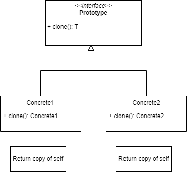

# Prototype - Creational (Criação)

## Intenção

_Especificar os tipos de objetos a serem criados usando uma instância-protótipo e criar novos objetos pela cópia desse protótipo_

---

## Destilando a intenção

A intenção acima significa que você pode criar objetos protótipos que têm um método específico (`clone`) para clonar seus dados em um novo objeto. Isso evita a recriação de objetos caros ou complexos para criados.

---

## Implementação

## Estrututa

## Aplicabilidade

Use o Prototype quando:

- precisar que seu código não dependa de classes concretas para a criação de novos objetos
- quiser evitar explosão de subclasses para objetos muito similares
- quiser evitar a recriação de objetos "caros" ou "complexos"

## Consequências

O que é bom ou ruim no Prototype:

**Bom:**

- Oculta classes concretas do código cliente
- Ajuda na criação de objetos caros ou complexos
- Evita a explosão de subclasses

**Ruim:**

- Clonar objetos que tem referências para outros objetos pode ser super complexo
