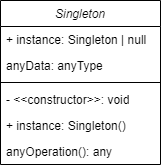

# Singleton - Creational (Criação)

## Intenção

_Garantir que uma classe tenha somenta uma instância no programa e fornecer um ponto de acesso global para a mesma._

---

## Destilando a intenção

O Singleton é um padrão de projeto que tem a intenção de resolver dois problemas em uma aplicação:

- **Garantir que uma classe tenha somente um instância no programa** - isso é muito comum para programas que acessam recursos compartilhados, como bases de dados, sistemas de arquivos, interfaces gráficas, spoolers de impressão, módulos de um programa e mais.
- **Fornecer um ponto de acesso global para a mesma** - isso deixa o singleton muito parecido com variáveis globais, porque temos um único objeto, com acesso global, sendo usado por várias partes de aplicação.

Apesar de ser um dos padrões mais usados na atualidade, requer conhecimento e cuidado ao utilizá-lo. Um programador pode facilmente criar um Singleton que gera problemas de concorrência em um programa.

Note que o Singleton tem duas responsabilidades e isso quebra a regra do SRP (Single Responsibility Principle).

## Estrutura

## 🚨 Aplicabilidade

Use o singleton quando:

- Use o singleton quando uma classe precisa ter somente uma instância disponível em todo o seu programa;
- Use o singleton quando perceber que está usando variáveis globais para manter partes importantes do programa, como variáveis de configuração que são usadas por toda a aplicação.

## 🗃️ Implementação - Teoria

Isso pode mudar de linguagem para linguagem, em Python seria de uma maneira, em Javascript de outra e em linguagens com tipagem estáticas, como TypeScript, de outra. Mas o senso comum sobre singletons é o seguinte:

- Declarar um campo `privado` na classe para armazenar a instância do Singleton.
- Declarar um método public (getter) para obter a instância do Singleton.
- Na chamada do método público, adicione _lazy instantiation_, ou seja, verifique se uma instância do Singleton já foi criada; se foi, retorne-a, se não crie uma nova instância e retorne-a.
- Fazer o construtor padrão privado, para prevenir que outros objetos usem o operador `new` com a classe singleton.

## Consequências

O que é bom ou ruim nos Singletons;

**Bom:**

- Acesso controlado por encapsulamento à instância única;
- É possível permitir um número variável de instâncias (pode soar estranho, mas é possível criar um Singleton que permite n instâncias de uma classe);
- É possível user thead lock para garantir que duas partes do código não alterem o singleton simultaneamente;
- Usa _lazy instantiation_, ou seja, o Singleton só será instanciado no momento do uso;

**Ruim:**

- É mais difícil de testar;
- Viola o princípio da responsabilidade única;
- Requer tratamento especial em casos de concorrência;
